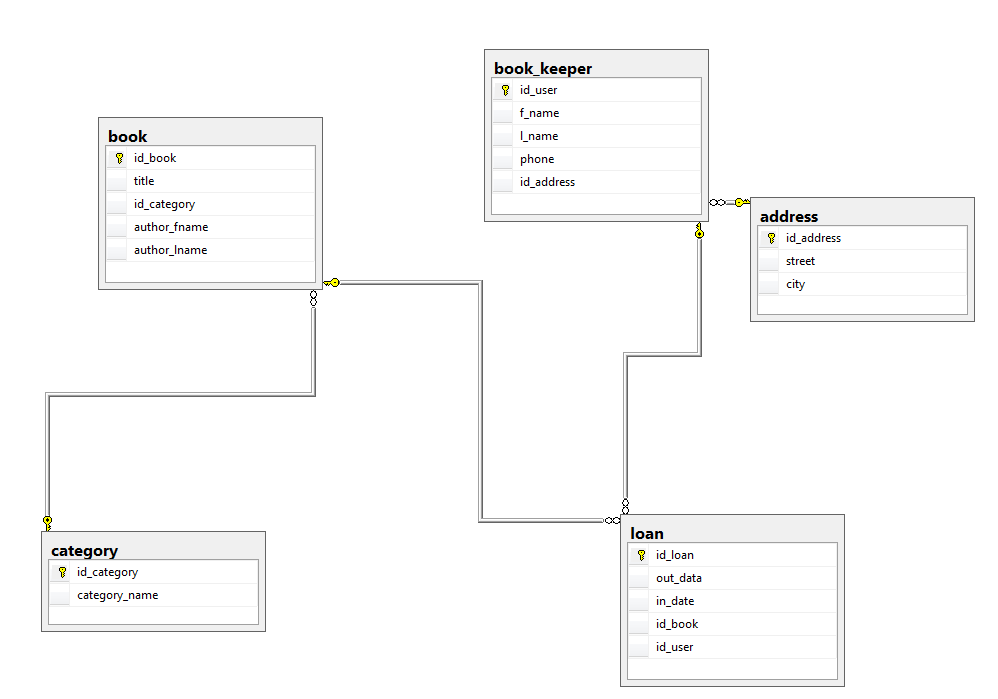

# Library-with-SQL-Server
## Simulation of a Book Library connected with an SQL Server

SQL Server databases to the project are in the DB directory
- libraryDB is the main DB
- testDB is a dummy DB used for testing purposes

Database Architecture presents the picture below:

